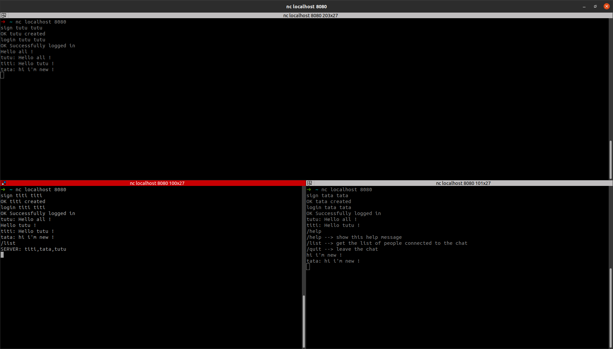

# Documentation serveur Chat

Le Chat est un des salons du serveur. Lorsqu'un client qui est dans le salon envoie un message au serveur, alors il est
renvoyé à toutes les personnes du salon avec le format suivant :

```shell
{username}: this is a super message
```

## Commandes

Des commandes sont disponibles pour les utilisateurs afin de plus avoir d'interactivité avec l'outil.

### /list

Si le client envoie `/list` au serveur, alors il reçoit la liste de tous les clients séparés d'une virgule, 
précédé de `SERVER: `.

### /quit

Déconnecte l'utilisateur du chat et le renvoie au [menu](doc-menu.md).

## Example

Vous pouvez voir ci-dessous un example de 3 clients discutant sur le chat:
