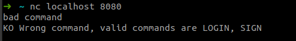
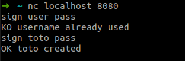
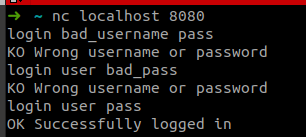

# Documentation serveur Login / Sign in

*Tous les examples seront fait avec un clientEntity simple* ***netcat*** *afin de pouvoir voir les discutions clientEntity-serveur.*

Une fois que la connectionEntity TCP est effectuée avec le serveur, deux commandes peuvent être exécutées.



## SIGN

La commande `SIGN {username} {password}` sert à créer un nouveau compte. Seul le nom d'utilisateur et le mot de passe
sont nécessaires pour la création d'un compte.

### Succès

En cas de succès, le serveur renvoie une réponse ayant le format suivant:

```shell
OK {username} created
```

### Erreur

En cas d'erreur, le serveur renvoit une réponse commançant avec `KO` suivit d'un message d'erreur. Une erreur peut être
dûe à:

* un nom d'utilisateur déjà existant
* une erreur interne au serveur (bug)

### Example



## LOGIN

La commande `LOGIN {username} {password}` sert à se connecter. Vous ne pouvez vous connecter qu'à un compte qui existe
déjà ...

### Succès

En cas de succès, le serveur renvoit une réponse commençant par `OK` suivit d'un message de succès

### Erreur

En cas d'erreur, le serveur renvoit une réponse commançant par `KO' suivit d'un message d'erreur. Une erreur peut être
dûe à:

* un mauvais nom d'utilisateur
* un mauvais mot de passe
* une erreur interne au serveur (bug)

Une fois login, vous êtes redirigé vers le menu. Voir la [documentation](doc-menu.md)

### Example

