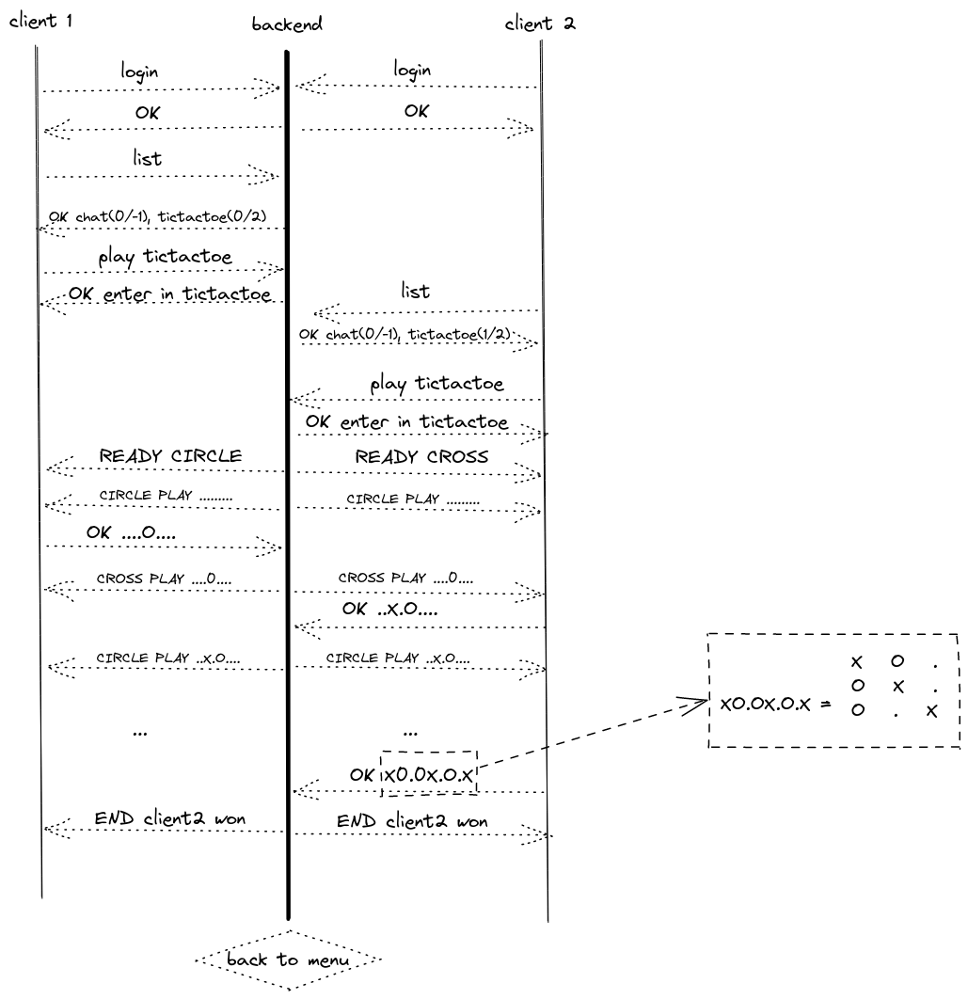

# Documentation serveur Morpions(TicTacToe)

*Tous les examples seront fait avec un clientEntity simple* ***netcat*** *afin de pouvoir voir les discutions
clientEntity-serveur.*

## Règles du jeu

Le morpion se joue sur une grille de 3x3. Les règles implémentées ici sont simples. Chacun leur tour les joueurs
positionne sur la grille un de leur pion, qui est soit une croix, soit un cercle, jusqu'à une limite de 3 pions par
équipe.

Une fois les 3 pions de chaque équipe, les joueurs vont pouvoir à leur tour bouger un pion sur une case adjacente.

L'objectif est d'aligner ses trois pions verticallement, horizontallement ou diagonnalement.

## Représentation du terrain

Pour les discutions client-serveur, il est ici préférable d'envoyer la valeur du plateau en une seule ligne, alors la
représentation est la suivante :

* `.` pour les cases vides
* `X` pour les croix
* `O` pour les cercles

Les trois premiers caractères représentent la première ligne, les trois suivant la seconde et les trois derniers la
dernière ligne.

`.XOO.XXO.` est donc la représentation de :

| .   | X   | O   |
|-----|-----|-----|
| O   | .   | X   |
| X   | O   | .   | 

## Schema des discutions client - serveur

